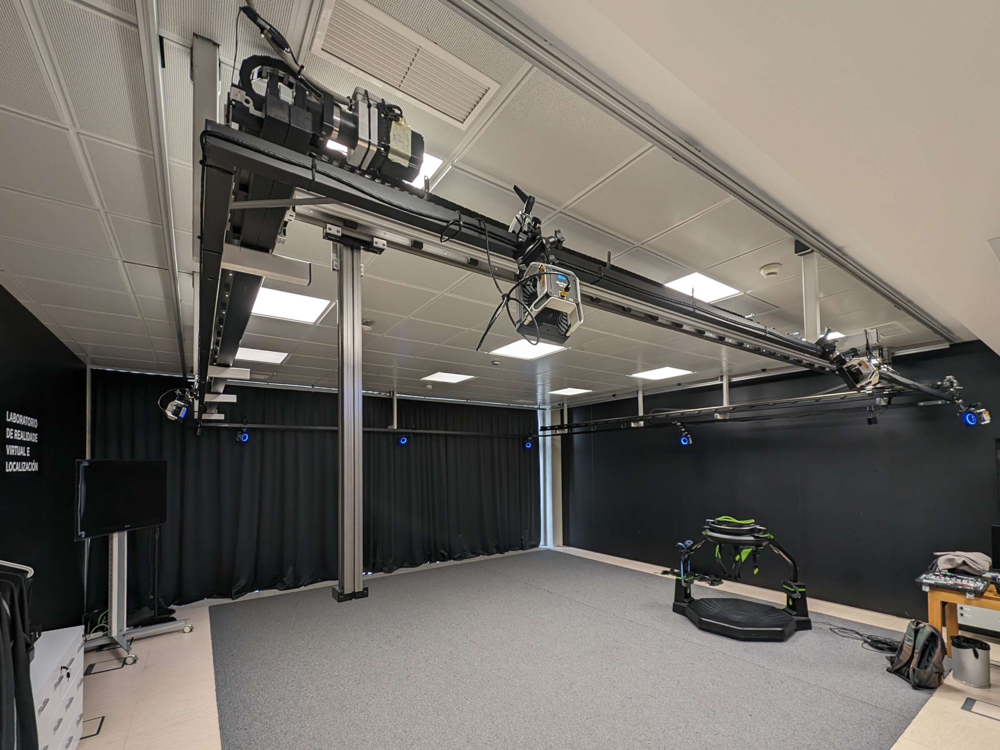

# LinuxCNC Gantry Robot System

<div align="center">



[](https://linuxcnc.org/)
[](https://creativecommons.org/licenses/by-sa/4.0/)
[](docs/)
[](https://python.org)

</div>

## 🎯 Overview

A large high-precision 3-axis gantry robot system using [LinuxCNC](https://www.linuxcnc.org), integrated with [Mesa Electronics](https://store.mesanet.com/) interface cards and [igus® dryve D1](https://www.igus.eu/product/D1) motor controllers.

The system was developed from our [LinuxCNC motor control testbed](https://github.com/your-org/linuxcnc-testbed), which ensured the main components of the system were able to work reliably.

The repository includes a **custom calibration solution** that leverages an existing [OptiTrack](https://optitrack.com/) motion capture system in the installation room to measure and compensate for errors in the gantry movement. Using this solution the gantry robot can achieve sub-centimeter precision across the entire work envelope.

## ✨ Key Features

- **🕹️ 3-Axis Control**: X, Y, Z linear axes.
- **⏱️ Real-time Coordination**: Precise real-time multi-axis motion using LinuxCNC with MESA interface cards and igus® dryve D1 motor controllers.
- **⚙️ Industrial Motors**: 3 NEMA 34 brushless motors (X and Y axes) and a NEMA 24 stepper motor (Z axis).
- **🔁 Closed Loop Control**: High-precision encoder feedback for accurate positioning.
- **🚦 Visual Indicators**: Custom LED status system.
- **🏗️ Large Work Envelope**: 5.3m (X) × 5.2m (Y) × 1m (Z) working volume.
- **📐 Positioning calibration**: Software to analyze OptiTrack measurements and custom LinuxCNC kinematics module for compensation of positioning errors.
- **🛡️ Safety Systems**: Emergency stop and inductive limit sensors.
- **💪 Heavy Duty**: Built with igus® self-lubricating linear units enabling lifelong operation of the moving parts without external lubrication.

## 📖 Documentation

The following documentation is provided in this repository:

- 📘 **Technical Documentation**: Complete system documentation and setup guide in `docs/`
- ⚡ **Electrical Installation**: KiCAD electrical schematics in `electrical_installation/`

To build the documentation:

```bash
cd docs
pip install -r requirements.txt
make html
```

## 📐 Positioning calibration

The gantry robot can be calibrated to compensate for positioning errors using an existing OptiTrack motion capture system in the installation room. For this, the repository provides the following software:

- **Custom `calibxyzkins` LinuxCNC Kinematics Module** in the `linuxcnc/components/linuxcnc_calibrated_xyz_kins`: compensates for the positioning errors in real-time
- **Calibration Analysis Software** in the `calibration/` folder: Python-based tools for processing the OptiTrack data and generating the calibration parameters

## 🛠️ Hardware Components

| Component | Model | Quantity | Function |
|-----------|-------|----------|----------|
| **Control Computer** | PC running LinuxCNC | 1 | Real-time motor coordination |
| **Motor Controllers** | igus® dryve D1 | 4 | Individual motor control |
| **Main Interface** | MESA 7I96S | 1 | Ethernet-LinuxCNC bridge and stepper motor control |
| **I/O Expansion** | MESA 7I77 | 1 | Analog control for brushless motors and I/O signals |
| **X-Axis Motor** | igus® MOT-EC-86-C-I-A | 2 | NEMA 34 brushless with 1000 PPR encoder |
| **Y-Axis Motor** | igus® MOT-EC-86-C-I-A | 1 | NEMA 34 brushless with 1000 PPR encoder |
| **Z-Axis Motor** | igus® MOT-AN-S-060-035-060-M-C-AAAC | 1 | NEMA 24 stepper with 500 PPR encoder |
| **Emergency Stop** | Push-button with NO/NC contacts | 1 | System safety shutdown |
| **Limit Switches** | igus® inductive sensors | 4 | Position boundary detection |
| **48V Power Supply** | MEAN WELL SDR-960 | 3 | Brushles motors power |
| **24V Power Supply** | MEAN WELL SDR-240 | 1 | Stepper motor power |
| **24V Power Supply** | -  | 1 | igus® Drive D1 logic and MESA 7I77 field power |
| **5V Power Supply** | MEAN WELL MDR-20-5   | 1 | MESA 7I77 field I/O logic power |

## 🔧 System Architecture


## 📁 Repository Structure

```txt
gantry-robot/
├── 📄 README.md                    # This file
├── 🎥 media/                       # Pictures and videos
├── 📚 docs/                        # Technical documentation
├── 🕹️ linuxcnc/                    # LinuxCNC configuration files
│   ├── configs/                    # Machine configurations
│   └── components/                 # Custom LinuxCNC components
├── 📐 calibration/                 # Calibration system
│   ├── src/                        # Python analysis and calibration tools
│   └── measurements/               # OptiTrack measurement data
├── ⚡ electrical_installation/     # Electrical documentation
│   ├── schematics/                 # KiCAD electrical diagrams
│   └── photos/                     # Installation photos
├── 🔩 cad/                         # CAD files and mechanical drawings
└── 📄 documents/                   # Component datasheets and manuals
```

## 📄 License

This repository contains files under different licenses:

- **Manufacturer documents** (`documents/`): The Files in the `documents/` directory are datasheets and manuals from different manufacturers and retain their original copyright, these are included for reference only.

- **Gantry CAD file** (`cad/gantry/gantry.FCStd`): CAD file of the gantry structure. Copyright igus® GmbH.

- **LinuxCNC Components** (`linuxcnc/components/`): [GPL v2 or later](https://www.gnu.org/licenses/old-licenses/gpl-2.0.html)

- **Calibration Source Code** (`calibration/src/`): [MIT License](https://opensource.org/licenses/MIT)

- **Project Files** (all other files): [CC BY-SA 4.0](https://creativecommons.org/licenses/by-sa/4.0/)
