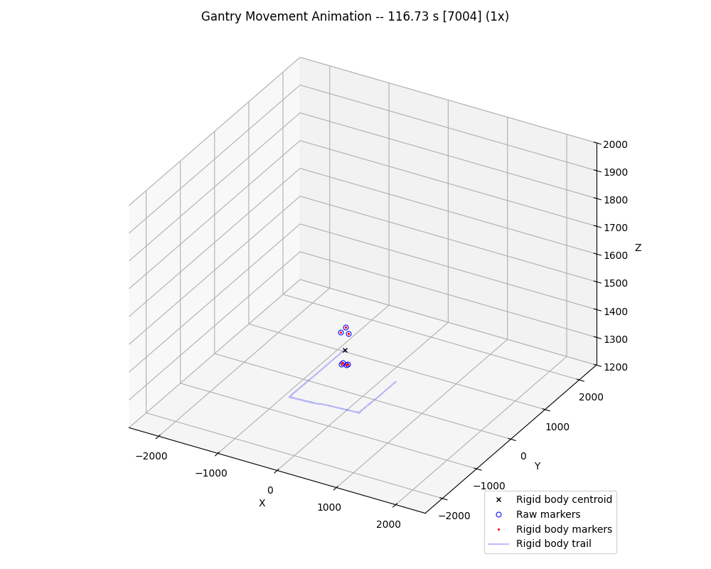
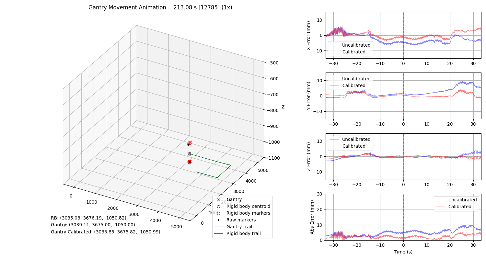
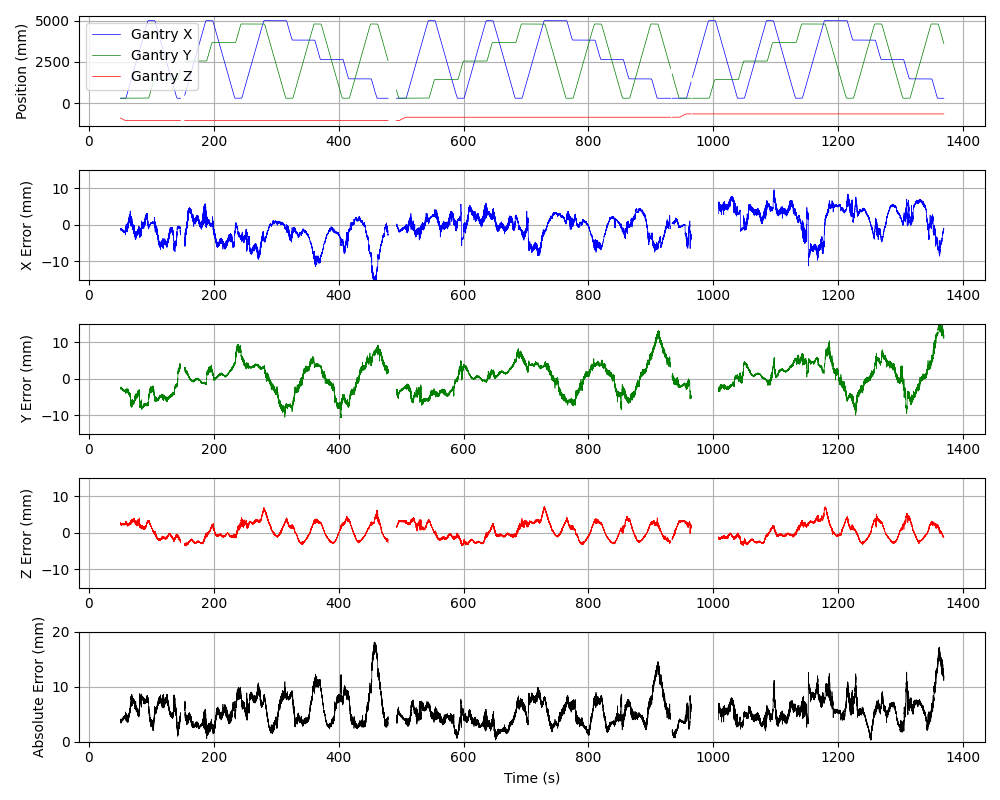
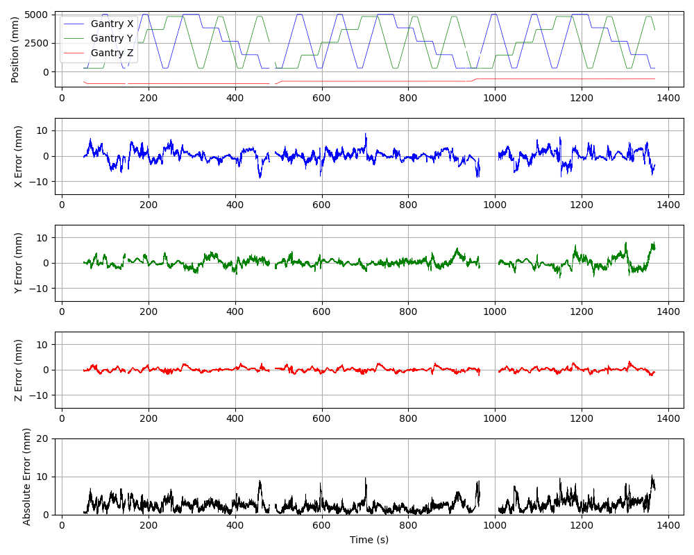
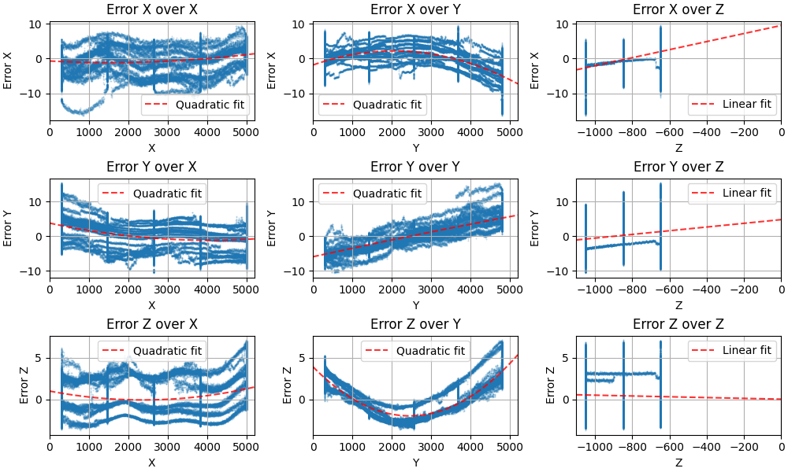
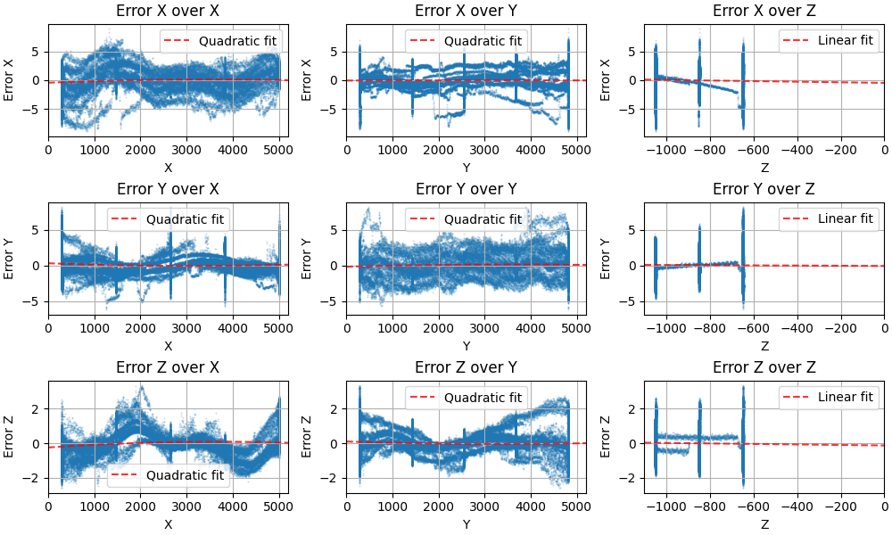
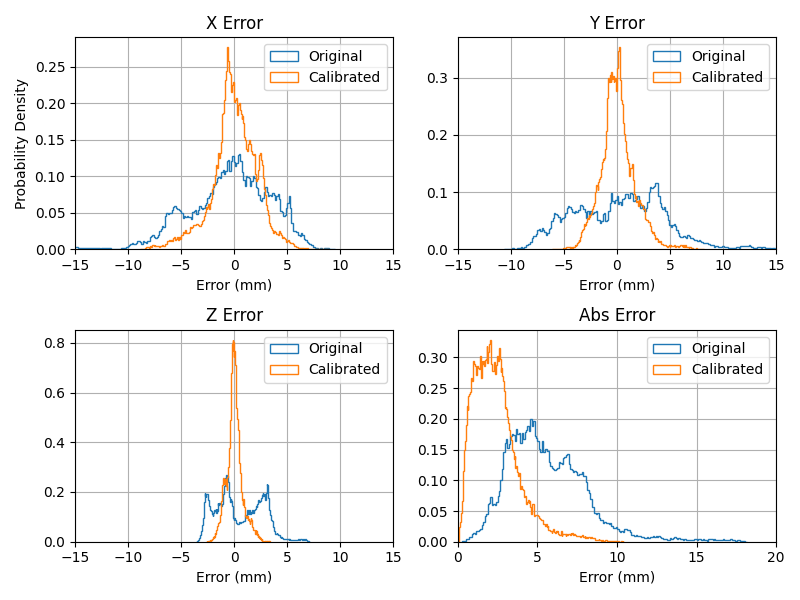
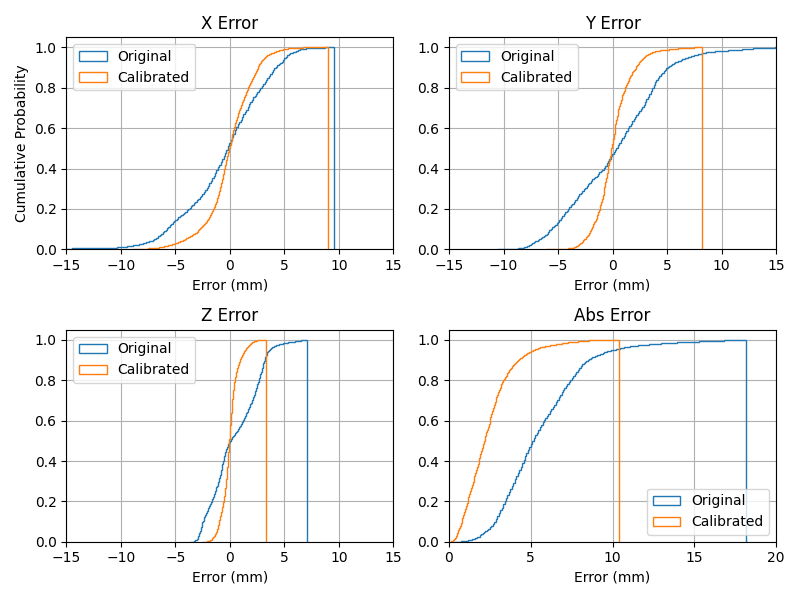

# Gantry Robot Error Analysis and Calibration

This directory contains Python scripts and utilities for analyzing and calibrating the gantry robot system. The system integrates OptiTrack motion capture data with gantry robot position data to perform error analysis and calibration.

**important**: It is assumed that the gantry data is the commanded position of the gantry robot and the OptiTrack data is the actual position of the gantry robot. After the calibration is complete it can be evaluated with several scripts, which correct the OptiTrack data with the calibration parameters and compare the obtained positions with the reference gantry data.

## System Overview

The system consists of several scripts to process and analyze the data:

1. **Raw Data Visualization**: `plot_movement_gantry.py` and `plot_movement_optitrack.py` scripts to visualize the raw gantry and OptiTrack data before calibration.
2. **Calibration**: `run_calibration.py` is the script that processes the raw data, performing the following steps:
   - **Alignment**: Temporal and spatial alignment of OptiTrack and gantry robot coordinate systems using translation, rotation, and time shift transformations.
   - **Correction**: Non-orthogonal and non-linear transformation of the OptiTrack data to correct errors intrinsic to the gantry robot.

3. **Analysis**: Various scripts for plotting and analyzing the gantry and OptiTrack data, which can be executed after the calibration is complete:
   - `check_params.py`: Check the calibration parameters.
   - `print_calibxyzkins_config.py`: Print the HAL configuration for the `calibxyzkins` module.
   - `plot_movement.py`: Visualize the gantry and OptiTrack path.
   - `plot_errors.py`: Plot positioning errors over time.
   - `plot_errors_scatter.py`: Plot positioning errors scatter plots.
   - `plot_errors_probability.py`: Plot positioning errors probability distributions.

After the calibration is performed, the calibration parameters can be used to correct the gantry position data with the `calibxyzkins` module of LinuxCNC included in this repository.

## Calibration Process

The calibration process performs two steps: **alignment** and **correction**.

### Step 1: Alignment

First, the OptiTrack data must be aligned with the gantry data to account for differences in coordinate systems and timing. This alignment process involves finding the following parameters:

- **Translation**: Shifts in X, Y, and Z axes
- **Rotation**: Rotations around X, Y, and Z axes. By default the rotation center is `(2500, 2500, -750)`, but it may be changed.
- **Time Shift**: Temporal alignment to account for timing differences.

The alignment parameters are found using numerical optimization with the `scipy.optimize.minimize` function (Powell method by default). The objective to minimize is selectable via the `objective` setting: the mean squared error (`mse`, the default) or the mean Euclidean distance (`mean_distance`) between the gantry and the aligned OptiTrack positions.

### Step 2: Correction

Analysis of scatter plots of the positioning errors (see "Plot Positioning Errors Scatter" section in Usage Examples below) reveals clear patterns in positioning errors:

- **Y-axis position affects errors in all axes**
- **X-axis position affects errors in the Y-axis**
- **Z-axis position affects errors in X and Y axes**

These systematic deviations can be corrected by applying a coordinate transformation when controlling the gantry robot. For this we consider a general coordinate transformation with both first-order and second-order components:

$$
\begin{bmatrix}
x' \\ y' \\ z'
\end{bmatrix} =
\underbrace{
\begin{bmatrix}
a_{11} & a_{12} & a_{13} \\ a_{21} & a_{22} & a_{23} \\ a_{31} & a_{32} & a_{33}
\end{bmatrix}
}_{\normalsize \mathbf{A}}
\begin{bmatrix}
x \\ y \\ z
\end{bmatrix} +
\underbrace{
\begin{bmatrix}
b_{11} & b_{12} & 0 \\ b_{21} & b_{22} & 0 \\ b_{31} & b_{32} & 0
\end{bmatrix}
}_{\normalsize \mathbf{B}}
\begin{bmatrix}
x^2 \\ y^2 \\ z^2
\end{bmatrix} +
\underbrace{
\begin{bmatrix}
c_1 \\ c_2 \\ c_3
\end{bmatrix}
}_{\normalsize \mathbf{c}}
$$

where $x, y, z$ are the aligned OptiTrack position coordinates (the actual position of the gantry robot), $x', y', z'$ are the corrected position coordinates (the target position for the gantry control), and $\mathbf{A}, \mathbf{B}, \mathbf{c}$ are the transformation matrices and vector that need to be optimized.

**Note**: The third column of the second-order matrix $\mathbf{B}$ is set to zero because the Z-axis measurement interval is small, making the $z^2$ term unreliable if $z$ is extrapolated.

This transformation consists of:

1. Matrix $\mathbf{A}$: Linear transformation that handles scaling, rotation, and shear.
2. Matrix $\mathbf{B}$: Quadratic transformation that corrects non-linear distortions.
3. Vector $\mathbf{c}$: Constant offset.

The correction parameters are found by minimizing the error between the corrected OptiTrack positions and the gantry positions, with the objective selectable via the `objective` setting. Because the transformation is linear in $\mathbf{A}, \mathbf{B}, \mathbf{c}$, the mean squared error (`mse`, the default) is minimized with `numpy.linalg.lstsq`, while the mean Euclidean distance (`mean_distance`) is minimized iteratively with `scipy.optimize.minimize` (Powell method by default).

## Parameters Validation

The `calibxyzkins` module of LinuxCNC included in this repository uses the Newton-Raphson algorithm to solve the inverse kinematics problem: given desired axes positions $x', y', z'$, it finds the corresponding joint positions $x, y, z$ that satisfy the transformation equation:

$$\mathbf{f}(x, y, z) = \mathbf{A} \begin{bmatrix} x \\ y \\ z \end{bmatrix} + \mathbf{B} \begin{bmatrix} x^2 \\ y^2 \\ z^2 \end{bmatrix} + \mathbf{c} = \begin{bmatrix} x' \\ y' \\ z' \end{bmatrix}$$

To ensure the calibration parameters are valid we include the `check_params.py` script, which performs the following validation tests:

### 1. Jacobian Invertibility Test

The Newton-Raphson method requires computing the Jacobian matrix of the transformation function:

$$\mathbf{J} = \frac{\partial \mathbf{f}}{\partial [x, y, z]} = \mathbf{A} + 2 \cdot \text{diag}(x, y, z) \cdot \mathbf{B}$$

The Jacobian matrix must be invertible throughout the robot's workspace. This is tested using an approach based on the Neumann series.

The Neumann series states that $(\mathbf{I} - \mathbf{T})$ is invertible if $\|\mathbf{T}\| < 1$, where $\mathbf{I}$ is the identity matrix and $\|\cdot\|$ denotes a matrix norm.

For a matrix of the form $\mathbf{X} + \mathbf{Y} = \mathbf{X}(\mathbf{I} + \mathbf{X}^{-1}\mathbf{Y})$, the matrix has an inverse if $\|\mathbf{X}^{-1}\mathbf{Y}\| < 1$.

Applying this to our Jacobian:

- $\mathbf{X} = \mathbf{A}$
- $\mathbf{Y} = 2 \cdot \text{diag}(x, y, z) \cdot \mathbf{B}$

Therefore, the Jacobian $\mathbf{J}$ is invertible if $\mathbf{A}$ is invertible and $\|2 \cdot \mathbf{A}^{-1} \cdot \text{diag}(x, y, z) \cdot \mathbf{B}\| < 1$ for the maximum absolute values of $x, y, z$ in the joint space bounds.

This condition is checked in the `check_params.py` script using both the 1-norm and infinity-norm.

### 2. Bounds Test

The coordinate transformation must respect the physical limits of the robot, i.e., the desired axes positions $(x', y', z')$ must be within the robot's axes limits, and the corresponding joint positions $(x, y, z)$ computed by the inverse kinematics must be within the robot's joint limits.

This condition is checked in the `check_params.py` script by finding the minimum and maximum values that each joint can reach when the axes positions are constrained to their limits. These values must fall within the specified joint limits of the robot for the parameters to be valid.

## Installation and Usage

1. **Install dependencies**: Use `uv` or `pip` to create a virtual environment and install the required Python packages.
   - With `uv`:

     ```bash
     uv venv && source .venv/bin/activate && uv pip install -r requirements.txt
     ```

   - With `pip`:

     ```bash
     python -m venv .venv && source .venv/bin/activate && pip install -r requirements.txt
     ```

2. **Prepare the data**: The system requires both gantry position data (CSV) and OptiTrack motion capture data (CSV) in the expected formats (see Data Format section below).

3. **Add a configuration file**: Create a `config.json` file with the calibration settings.

4. **Run the calibration script**: Execute the calibration script `run_calibration.py` to generate a `calibration.json` file with the alignment and correction parameters.

5. **Visualize the results**: Use the plotting scripts to visualize the results.

See the Usage Example section below for more details.

## Data Format

### Gantry Data (CSV)

The gantry data is a CSV file with the following columns:

- `time` - Unix time (seconds since 1970-01-01 00:00:00 UTC) as a floating-point number.
- `x`, `y`, `z` - Position coordinates in mm as floating-point numbers.

### OptiTrack Data (CSV)

The OptiTrack data is the CSV exported from the OptiTrack Motive software. The format follows this structure:

- **Line 1**: Header with metadata (format version, take name, capture frame rate, export frame rate, start time, total frames, rotation type, length units, coordinate space, etc.)
- **Line 2**: Blank line
- **Line 3**: Object types for each column (e.g., "Rigid Body", "Rigid Body Marker", "Marker")
- **Line 4**: Object names for each column (e.g., "Grua", "Grua:Marker1", "Active 1", "Unlabeled 1007")
- **Line 5**: Unique object IDs (hexadecimal identifiers for each marker/object)
- **Line 6**: Data types for each column ("Rotation" or "Position")
- **Line 7**: Column headers ("Frame", "Time (Seconds)", "X", "Y", "Z", "W" for quaternion rotation, then "X", "Y", "Z" for position coordinates)
- **Line 8 onwards**: Data rows containing:
  - Frame number (integer)
  - Time in seconds (floating-point)
  - Rotation and/or position coordinates.

**Note**: Missing or untracked data points appear as empty cells in the CSV.

## Usage Examples

We will use the measurement `2025-04-09` (located in `../measurements/2025-04-09/`) to explain the code functionality. To execute the code it is recommended to change the working directory to the measurement directory:

```bash
cd ../measurements/2025-04-09/
```

This way the scripts will be able to find the data files without needing to specify them by command line arguments.

### Gantry and OptiTrack Path Visualization

The raw gantry and OptiTrack data can be visualized using the `plot_movement_gantry.py` and `plot_movement_optitrack.py` scripts, respectively. For example, to visualize the OptiTrack data, run:

```bash
python ../../src/plot_movement_optitrack.py
```

It will open a window with the OptiTrack data visualization. The image below shows the OptiTrack data visualization.



You can use the keyboard to control the playback of the data. The available controls are shown when the script is executed:

```text
Animation Controls:
------------------
Space: Play/Pause
PageUp/PageDown: Increase/Decrease playback speed
Shift + PageUp/PageDown: Increase/Decrease playback speed by 5x
m/n: Step forward/backward 1 frame
M/N: Step forward/backward 60 frames
Ctrl+m/Ctrl+n: Step forward/backward 600 frames
i/o: Jump to start/end
```

### Calibration Configuration

Before running the calibration script, you need to create a JSON configuration file, by default named `config.json`. The configuration file defines the calibration parameters, data processing options, and analysis settings. The configuration format follows the structure defined in the `CalibrationConfig` class in `data.py`, allowing you to customize:

- Alignment parameters, objective, and `minimize_options` settings
- Correction parameters, objective, and `minimize_options` settings
- Frame skipping ranges for excluding poor tracking data

The contents of the configuration file used for the `2025-04-09` measurement are the following:

```json
{
  "alignment": {
    "init_params": [2500, 2500, -2500, 0, 0, -1.5707963267948966, 50],
    "max_rotation": 0.098174770424681,
    "rotation_center": [2500, 2500, -750],
    "objective": "mse",
    "minimize_options": {
      "method": "Powell",
      "tolerance": 1e-9,
      "display": true
    }
  },
  "correction": {
    "enabled": true,
    "objective": "mse",
    "minimize_options": {
      "method": "Powell",
      "tolerance": 1e-9,
      "display": true
    }
  },
  "skip_frames": {
    "enabled": true,
    "ranges": [
      [8800, 9200],
      [28750, 29550],
      [55900, 56050],
      [57870, 58000]
    ]
  }
}
```

Some important considerations:

- The initialization parameters in the `init_params` field of the `alignment` section are the initial values for the optimization of the calibration alignment step. If not specified, default values of 0 are used. The parameters are the following, in the order they are used in the optimization (see the `get_processed_data` function in `data.py`):

  - `x_shift`: Translation along the x-axis in mm
  - `y_shift`: Translation along the y-axis in mm
  - `z_shift`: Translation along the z-axis in mm
  - `x_rotation`: Rotation around the x-axis in radians
  - `y_rotation`: Rotation around the y-axis in radians
  - `z_rotation`: Rotation around the z-axis in radians
  - `time_shift`: Time shift in seconds

  Important: These parameters may be needed to be set manually for the optimization to converge to the optimal value.

- The `max_rotation` parameter is the maximum rotation allowed in the optimization for all axes. If not specified or if this value is too large the optimization may not converge to the optimal value.

- The `skip_frames` parameter is a list of frame ranges to skip. The frame ranges are defined as a list of tuples, where each tuple contains the start and end frame of the range. The frame ranges are used to exclude frames with poor tracking quality.

### Run the calibration

To execute the calibration execute the `run_calibration.py` script:

```bash
python ../../src/run_calibration.py
```

When you run the calibration script, the computed parameters (both alignment and correction) are saved in a `calibration.json` file, which is then used by the plotting and analysis scripts.

The contents of the calibration file used for the `2025-04-09` measurement are the following:

```json
{
  "alignment": [
    2569.064951390571,
    2431.945890597083,
    -2445.8453677141842,
    0.01621568645263669,
    -0.0019764080563279946,
    -1.627993124493423,
    48.529188401692736
  ],
  "correction": [
    0.9990369632649009,
    -0.0023705036806220222,
    -0.0010354716462371396,
    0.003519113620152516,
    1.0024657909515957,
    -0.004752129098771147,
    0.012339767658019774,
    0.003979069253835251,
    1.0001914458552963,
    2.205888871025789e-7,
    3.122118199676554e-7,
    2.3016495733564933e-7,
    -8.883515393297157e-7,
    -4.6904454317380076e-8,
    9.733292477941651e-7,
    9.648396195409736,
    0.8905471886524144,
    4.555186849749805
  ]
}
```

### Run the parameters validation

The `check_params.py` script is used to validate the calibration parameters. As explained in the Parameters Validation section, it performs a Jacobian invertibility test and a bounds test.

To run the validation execute the `check_params.py` script:

```bash
python check_params.py
```

The script accepts the following parameters to customize the joints and axes bounds:

- `--axis-min`: The minimum value of the X, Y, and Z axes.
- `--axis-max`: The maximum value of the X, Y, and Z axes.
- `--joint-min`: The minimum value of the X, Y, and Z joints.
- `--joint-max`: The maximum value of the X, Y, and Z joints.

### LinuxCNC Configuration for the `calibxyzkins` module

The `calibxyzkins` module included in this repository can be used to calibrate the gantry robot with the correction parameters obtained from the calibration process. To use the module, its HAL parameters must be set properly. These parameters can be generated using the `print_calibxyzkins_config.py` script:

```bash
python print_calibxyzkins_config.py
```

Which will output the following HAL configuration:

```text
# Calibration matrix A
setp calibxyzkins.calib-a.xx 0.9990369633
setp calibxyzkins.calib-a.xy 0.00351911362
setp calibxyzkins.calib-a.xz 0.01233976766
setp calibxyzkins.calib-a.yx -0.002370503681
setp calibxyzkins.calib-a.yy 1.002465791
setp calibxyzkins.calib-a.yz 0.003979069254
setp calibxyzkins.calib-a.zx -0.001035471646
setp calibxyzkins.calib-a.zy -0.004752129099
setp calibxyzkins.calib-a.zz 1.000191446

# Calibration matrix B
setp calibxyzkins.calib-b.xx 2.205888871e-07
setp calibxyzkins.calib-b.xy -8.883515393e-07
setp calibxyzkins.calib-b.xz 0
setp calibxyzkins.calib-b.yx 3.1221182e-07
setp calibxyzkins.calib-b.yy -4.690445432e-08
setp calibxyzkins.calib-b.yz 0
setp calibxyzkins.calib-b.zx 2.301649573e-07
setp calibxyzkins.calib-b.zy 9.733292478e-07
setp calibxyzkins.calib-b.zz 0

# Calibration vector C
setp calibxyzkins.calib-c.x 9.648396195
setp calibxyzkins.calib-c.y 0.8905471887
setp calibxyzkins.calib-c.z 4.55518685
```

### Gantry and Calibrated OptiTrack Path Visualization

The gantry and calibrated OptiTrack path can be visualized using the `plot_movement.py` script:

```bash
python ../../src/plot_movement.py
```

Note that the script accepts the `--no-correct` flag to show the OptiTrack position without applying the correction transformation.

The image below shows the gantry and calibrated OptiTrack path visualization.



As in the case of the raw data visualization scripts, you can use the keyboard to control the playback of the data. The available controls are shown when the script is executed:

```text
Animation Controls:
------------------
Space: Play/Pause
PageUp/PageDown: Increase/Decrease playback speed
Shift + PageUp/PageDown: Increase/Decrease playback speed by 5x
m/n: Step forward/backward 1 frame
M/N: Step forward/backward 60 frames
Ctrl+m/Ctrl+n: Step forward/backward 600 frames
i/o: Jump to start/end
```

### Plot Positioning Errors Over Time

The positioning errors between gantry and OptiTrack data over time can be plotted using the `plot_errors.py` script:

```bash
python ../../src/plot_errors.py
```

The script accepts the option `--time-unit` to specify the time unit of the x-axis. The available options are `s` (seconds) and `frames`. The default is `s` (seconds). The `frames` options can be used to check the ranges of frames with poor tracking quality, then they can be skipped by setting them in the configuration file.

The script also accepts the `--no-correct` flag to show the OptiTrack position without applying the correction transformation.

The image below shows the positioning errors over time with the `--no-correct` flag, i.e., without applying the correction transformation to the OptiTrack position.



The image below shows the positioning errors over time when applying the correction transformation to the OptiTrack position.



### Plot Positioning Errors Scatter

Positioning errors scatter plots between gantry and OptiTrack data can be plotted using the `plot_errors_scatter.py` script:

```bash
python ../../src/plot_errors_scatter.py
```

The script also accepts the `--no-correct` flag to show the OptiTrack position without applying the correction transformation.

The image below shows the positioning errors scatter plots with the `--no-correct` flag, i.e., without applying the correction transformation to the OptiTrack position.



The image below shows the positioning errors scatter plots when applying the correction transformation to the OptiTrack position.



### Plot Positioning Errors Probability Distributions

The positioning errors probability distribution can be plotted using the `plot_errors_probability.py` script:

```bash
python ../../src/plot_errors_probability.py
```

By default the script plots the probability distribution of the positioning errors for the x, y, and z axes. The image below shows the obtained probability distributions.



The script accepts the `--cumulative` flag to plot the cumulative distribution function of the positioning errors. The image below shows the cumulative distribution function of the positioning errors for the x, y, and z axes.



## License

See the LICENSE file for details.
